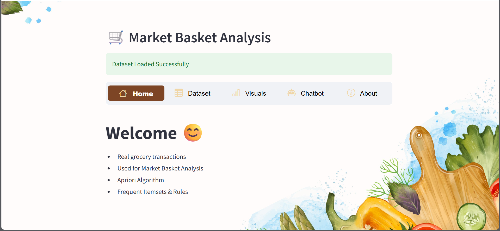

# Market-Basket-Analysis
I developed a comprehensive data analytics web application that integrates Market Basket Analysis, Association Rule Mining, NLP, and a Recommendation System into a single interactive platform using a grocery sales dataset.

## Analytics and Models
- Apriori Algorithm
- Association Rule Mining
- Support and Confidence

## Features
- User authentication
- Dataset statistics
- Interactive chatbot for queries

## Technologies Used
- Python
- Jupyter Notebook
- Pandas
- MLxtend

  ## Real-World Relevance
- This project reflects practical applications used in:
- Retail analytics
- E-commerce personalization
- Cross-selling optimization
- Inventory planning
- Customer purchase behavior analysis

## Application Preview

